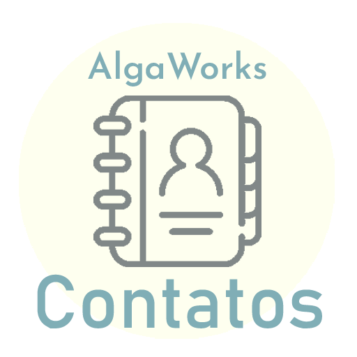
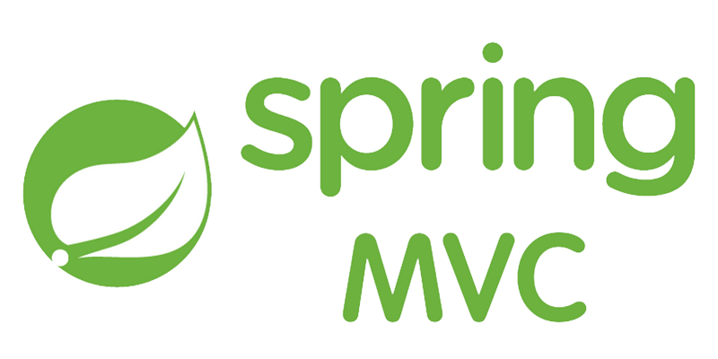
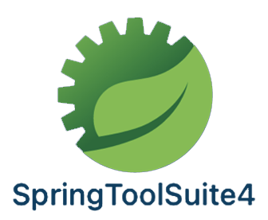
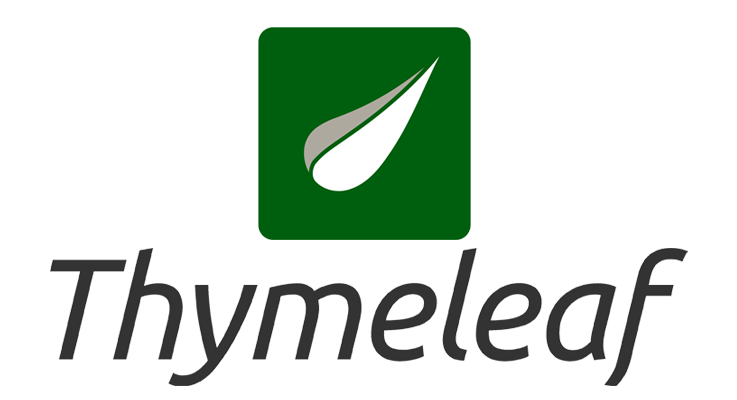

<p align="center">
  
</p>

# AlgaWorks Contatos

<h4 align="center"> 
	 Status: Concluded.
</h4>

<br/>

**Contact management Spring MVC web application.**

---

<p align="center">
  <a href="#about">About</a> •
  <a href="#learnings">Learnings</a> •
  <a href="#preview">Preview</a> •
  <a href="#tech-stack-and-tools">Tech Stack and tools</a> •
  <a href="#publication">Publication</a> •
  <a href="#author">Author</a> 
</p>

---

## About
<br/>

Project developed as a result of the teachings learned at Alga Works course "Lógica de Programação com Java para iniciantes".

A Model-View-Controller architecture application made using **Java**, **Spring framework**, including **Spring MVC**, **Maven**, **Thymeleaf**, **Hibernate - Jakarta Persistense (JPA)**, and **H2 in-memory Database**, that allows you to manage a contact list.

List, edit/ update, remove/ delete your contacts or even create new ones, inserting names and phone numbers.

🚨  **ATTENTION** ⚠️:

> Because it is a in-memory Database, data will not persist on disk and will be lost whenever the application is refreshed.

## Learnings
<br/>
The project concept aims to give some practice, learning and review on several things taught during the Alga Works' previously mentioned course such as:
<br/>
<br/>

- Introduction to computing;
- Algorithm;
- Programming languages;
  
<details open>
<summary>Java basics and using an IDE (Eclipse):</summary>
<br/>

- keywords;
- Variables - primitives and wrappers;
- Constants;
 
</details>

<details open>
<summary>Operators:</summary>
<br/>
	
- Arithmetic;
- Assignment;
- Comparison;
- Logical;
- String concatenation;

</details>

<details open>
<summary>Decision structures:</summary>
<br/>
	
- IF;
- Chained IF;
- Switch-case;

</details>

<details open>
<summary>Iterations:</summary>
<br/>
	
- For;
- While;
- Do-while;
- Break;
- Continue;

</details>

<details open>
<summary>Arrays:</summary>
<br/>

- 1, 2 and more than 2 dimensions;

</details>

<details open>
<summary>Methods:</summary>
<br/>

- Receiving parameters/ arguments;
- Scope;
- Returning values;
- Recursive;
- Method signature;
 
</details>

<details open>
<summary>Object Oriented Programming -> OOP:</summary>
<br/>
 
 - Objects;
 - Classes;
 - Packages -> Access modifiers;
 - Encapsulation;
 
	- Java Beans pattern;	
 
 - Classes and instances differences;
 
	- Instance methods;	

- Interfaces; 
 
 </details>
 
<details open>
<summary>Reading an writing data in files:</summary>
<br/>
 
 - "Files" class;
 
	- write and readAllLines methods;

- "Path" class;
- Exceptions handling;
	
	- Try and catch; 
	- Throws declaration;

</details>

<details open>
<summary>Using external code:</summary>
<br/>

- Libraries and frameworks;
- Sending email;
	
	- [javax.mail](https://mvnrepository.com/artifact/com.sun.mail/javax.mail/1.6.2)  -> JavaMail API;
	- [commons-email](https://commons.apache.org/proper/commons-email/download_email.cgi) -> Apache Commons email;
	

</details>

<details open>
<summary>Creating the final algorithm:</summary>
<br/>

- An CRUD Web Application;
	
	- Implementing what was seen before; 

</details>

## Preview

<h1 align="center">
	
</h1>


## Tech Stack and tools

<div style="display: inline_block"><br>
    
    
    
    
    
	
  	
    
    
    
</div>

## Publication

<br/>

> Clone this repository!

- Make a clone of this repository:

  ```bash
  git clone git@github.com:Macedovin/AlgaWorksContatos
  ```

- Access the repository directory:

  ```bash
  cd AlgaWorksContatos
  ```
- If you haven't installed Maven on your Machine, then use the following Maven command to run the Spring Boot application:

  ```bash
  ./mvnw spring-boot:run
  ```

🚨  **ATTENTION** ⚠️:

> Because it is a in-memory Database, data will not persist on disk and will be lost whenever the application is refreshed.

## Author

<br/>


Projeto criado pela [Alga Works](https://github.com/algaworks) e desenvolvido por [Vinicius&nbsp;Macedo](https://github.com/Macedovin).

<a href="mailto:macedo.vp@gmail.com" target="_blank"></a>&nbsp;
<a href="https://www.linkedin.com/in/vinicius-macedop/" target="_blank"></a>&nbsp;

